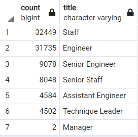
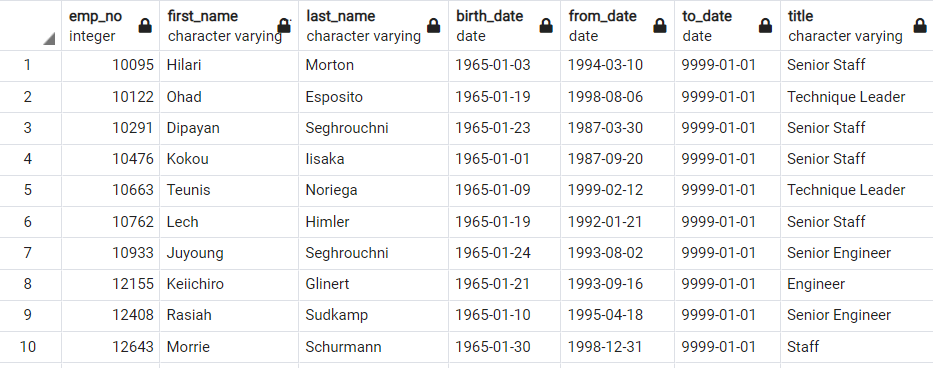
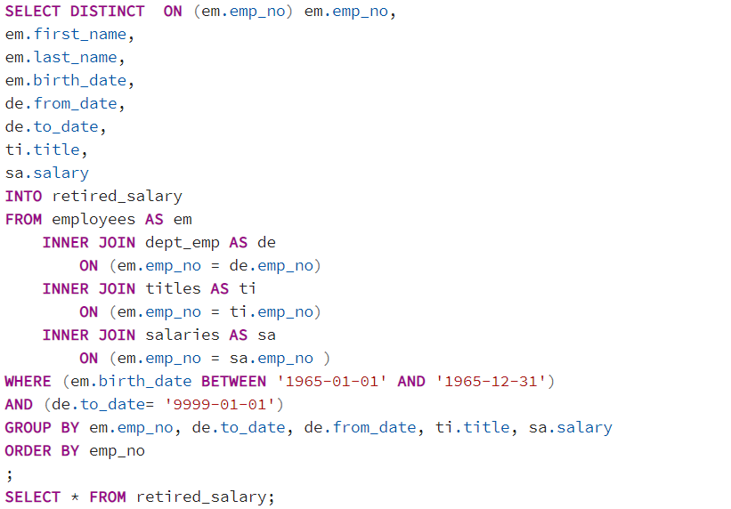
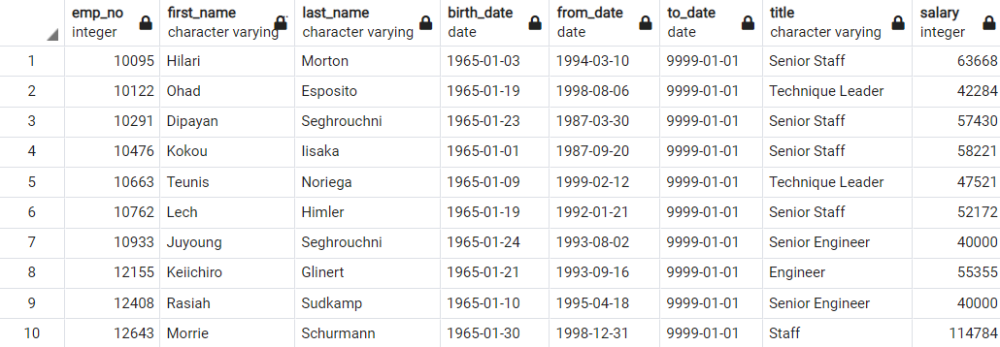
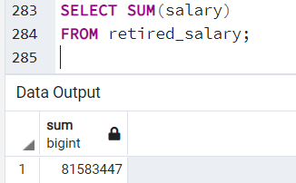

# Pewlett-Hackard-Analysis
## Overview of the analysis
As baby boomers begin to retire Pewlette Hackard is ready to look ahead to whho will be recieving retirement packages and which positions will need to be filled in the near future.
### Purpose
Our analysis will help generate the list of employees eligable for retirement packages. We will use SQL to create databases to sift through excel files and find the specified group of employees.
## Results: Provide a bulleted list with four major points from the two analysis deliverables. Use images as support where needed.
- There are 90,398 people eligible for retirement as shown in the table below with each of their corresponding titles. 
 
  
 
- Of the retiring a majority of the roles are Staff with 32,449 under this role  
- The second most retiring title is Engineer with 31,735 under this role  
- Of the roles needing to be filled, there are only 1,549 employees elegible for the mentorship program  
*The list of eligible employees is found in the table below * 
 
## Summary: 
Our analysis has given Pwelette Hackard some information about the change coming to their company due to the "silver tsunami". We were able to organize the information to find which roles and how many people in each role will need to be filled. We also found information to help with the transition that will tell us who is eligible for the mentorship program.
### How many roles will need to be filled as the "silver tsunami" begins to make an impact? 
 
  
 
The previosuly displayed table shows that there are seven positions that will need to be filled. The largest title that will need to be filled are Staff and Engineer making  up 71% of roles needing to be filled.  
 
### Are there enough qualified, retirement-ready employees  in the departments to mentor the next generation of Pewlett Hackard employees? 
The following chart shows which employees are elegibile to take on a mentorship role in a mentorship program.
 
 
In total there will be 90,398 prospective roles that will need to be filled. According to our Mentorship Eligibility table there are 1,549 people to take on this role. There are enough employees to mentor but they would be in charge of large groups of trainees. There is not enough mentors for a one to one mentorship ratio. 
It may also be beneficial to create a query that can tell us about the salries of those employees that are eligible for retirement to understand an idea of the budget for rehiring. We can create a query as shown below:  
 
 
 
We would then have the following table as output:  
 
 
 
We can also create another query to find the total of their salaries as shown below:  
 
 
They could use these tables and queires to help them better prepare for potential rehiring in the near future. 

